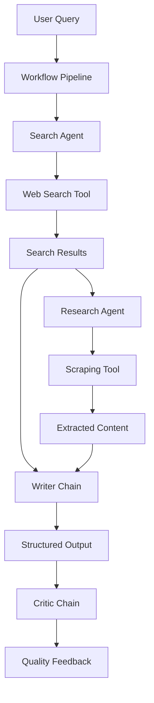
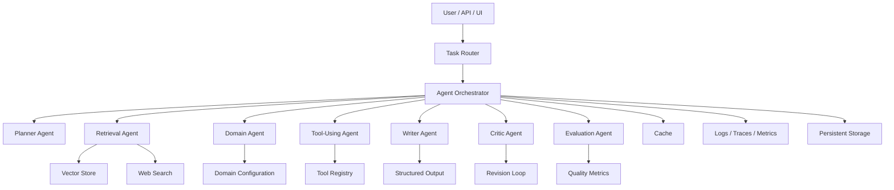

# Agentic AI Systems Platform

A production-oriented multi-agent AI infrastructure platform for research, automation, and knowledge workflows.

This repository is structured as an extensible agentic systems platform, not a single niche application. The current implementation starts with a research workflow because research is a useful first domain for testing search, scraping, synthesis, and critique. The long-term architecture is designed so additional agents and workflows can be added for operations, compliance, production monitoring, domain copilots, knowledge retrieval, and business automation.

The core identity of this project is reliable AI systems engineering:

- orchestration
- retrieval
- tool use
- observability
- evaluation
- retries and fallbacks
- streaming
- deployment
- modular agent design

## Current Status

### Implemented

- Python package using a `src/` layout
- `pyproject.toml` project configuration
- uv-based local environment workflow
- Editable install support for clean imports
- Modular agent, tool, chain, pipeline, model, and utility folders
- LangChain-based search agent
- LangChain-based research/scraping agent
- Tavily web search integration
- URL scraping and readable text extraction
- Report-writing chain
- Critic/review chain
- End-to-end research workflow as the first platform use case
- Logging utility
- Custom exception utility
- Environment variable loading through `.env`

### Planned

- LangGraph orchestration layer
- Streaming responses
- Adaptive retrieval
- Vector search and RAG
- Evaluation pipelines
- Observability and tracing
- Retry and fallback systems
- Caching layer
- Async processing
- Tool registry
- Streamlit demo UI
- FastAPI backend
- Docker deployment
- CI/CD pipeline

## Core Features

### Platform Capabilities

- Multi-agent orchestration
- Domain-specific agent composition
- Tool integrations
- Search and scraping workflows
- Structured synthesis and critique
- Modular pipelines
- Clean package imports through editable install
- Environment-based configuration

### Reliability Features

Current and planned reliability features include:

- structured logging
- retries with backoff
- timeouts for external tools
- fallback providers
- caching
- monitoring
- tracing
- token and cost tracking
- evaluation datasets
- hallucination checks
- source-grounding checks
- CI-based test execution

### Retrieval Features

Current:

- live web search
- URL scraping
- readable text extraction

Planned:

- vector search
- semantic retrieval
- adaptive retrieval strategy
- source ranking
- document chunking
- citation extraction
- persistent knowledge stores

## Example Use Cases

The platform architecture is intended to support multiple domains without changing the core system design:

- Competitive intelligence
- Research synthesis
- Regulatory intelligence
- Compliance monitoring
- Workflow automation
- Operations assistants
- Production monitoring agents
- Domain-specific copilots
- Knowledge retrieval systems
- Automated report generation
- Internal knowledge-base assistants

## Architecture

### Current Implementation

The first implemented workflow is a research pipeline. It proves the basic platform pieces: an agent can use tools, gather external information, synthesize an answer, and critique the output.



### Target Platform Architecture

The target architecture keeps the platform stable while allowing domain workflows to change.



## Project Structure

```text
.
|-- assets/
|   |-- learnings.md
|   `-- progress.md
|-- outputs/
|   `-- .gitkeep
|-- src/
|   `-- research_system/
|       |-- agents/
|       |   |-- research_agent.py
|       |   `-- search_agent.py
|       |-- chains/
|       |   `-- summary_chain.py
|       |-- config/
|       |   `-- __init__.py
|       |-- models/
|       |   `-- model_selection.py
|       |-- pipelines/
|       |   `-- research_pipeline.py
|       |-- tools/
|       |   `-- tool.py
|       `-- utils/
|           |-- custom_exception.py
|           `-- logger.py
|-- tests/
|   `-- __init__.py
|-- ui/
|   |-- __init__.py
|   `-- app.py
|-- .env.example
|-- .gitignore
|-- main.py
|-- pyproject.toml
|-- README.md
|-- requirements.txt
`-- uv.lock
```

Note: `ui/app.py` currently exists as a placeholder. The Streamlit UI is a roadmap item, not a finished feature yet.

## Quick Start

### 1. Clone the Repository

```bash
git clone <your-github-repo-url>
cd Multi-Agent-Research-System
```

### 2. Install uv

If uv is not installed, install it first:

```bash
pip install uv
```

You can also use the official uv installer from the uv documentation.

### 3. Create a Python 3.12 Environment

```bash
uv venv --python 3.12
```

This creates a local `.venv/` directory for the project.

### 4. Install Dependencies

```bash
uv sync
```

On Windows, if certificate validation fails:

```bash
uv sync --native-tls
```

This installs dependencies from `pyproject.toml` and `uv.lock`. It also installs the local package in editable mode so imports work cleanly across scripts, tests, notebooks, and future UI/API layers.

### 5. Configure Environment Variables

Create a `.env` file in the project root:

```bash
OPENAI_API_KEY=your_openai_api_key_here
TAVILY_API_KEY=your_tavily_api_key_here
```

Use `.env.example` as the reference file.

### 6. Run the Current Workflow

```bash
uv run python main.py
```

Windows TLS fallback:

```bash
uv run --native-tls python main.py
```

## Programmatic Usage

The current implemented workflow is the research pipeline:

```python
from research_system.pipelines.research_pipeline import run_research_pipeline

result = run_research_pipeline(
    "What are recent developments in AI factories in Germany?"
)

print(result["report"])
print(result["feedback"])
```

Future workflows can follow the same platform pattern:

```python
# examples of planned platform-level extension points
from research_system.pipelines.research_pipeline import run_research_pipeline

# future examples:
# from research_system.pipelines.operations_pipeline import run_operations_pipeline
# from research_system.pipelines.compliance_pipeline import run_compliance_pipeline
# from research_system.pipelines.production_pipeline import run_production_pipeline
```

## Clean Imports and Editable Install

This project uses a `src/` layout:

```text
src/research_system/
```

After running:

```bash
uv sync
```

the package is installed into the project environment. That means imports should use:

```python
from research_system.pipelines.research_pipeline import run_research_pipeline
```

not:

```python
from src.research_system.pipelines.research_pipeline import run_research_pipeline
```

This is important because Python should treat `research_system` as the top-level package. For notebooks, make sure the selected Jupyter kernel is the Python interpreter inside `.venv/`.

## Development Commands

Create or recreate the environment:

```bash
uv venv --python 3.12
```

Install dependencies and the local package:

```bash
uv sync
```

Run a command inside the project environment:

```bash
uv run python main.py
```

Add a runtime dependency:

```bash
uv add package-name
```

Example:

```bash
uv add langgraph
```

Add a development dependency:

```bash
uv add --dev pytest ruff mypy
```

Run tests:

```bash
uv run pytest
```

Compile-check Python files:

```bash
uv run python -m compileall src main.py ui
```

## Deployment

Planned deployment options:

- Docker
- Docker Compose
- FastAPI service layer
- Streamlit demo UI
- GitHub Actions CI/CD
- cloud deployment guide

Potential cloud targets:

- AWS ECS
- AWS Lambda
- Azure Container Apps
- Google Cloud Run
- Render
- Railway

## Technology Stack

Current:

- Python 3.12
- uv
- LangChain
- LangChain OpenAI
- Tavily
- BeautifulSoup
- Trafilatura
- Readability
- Requests
- python-dotenv
- Rich

Planned:

- LangGraph
- Streamlit
- FastAPI
- Chroma, Qdrant, or pgvector
- LangSmith or OpenTelemetry
- Docker
- GitHub Actions
- pytest
- ruff
- mypy

## Roadmap

### Phase 1: Foundation

- [x] Python package structure
- [x] uv environment workflow
- [x] Web search tool
- [x] Web scraping tool
- [x] Search agent
- [x] Research agent
- [x] Writer chain
- [x] Critic chain
- [x] End-to-end first workflow
- [ ] Replace hardcoded demo in `main.py` with CLI arguments
- [ ] Add tests for tools, chains, and pipeline logic

### Phase 2: Platform Orchestration

- [ ] Convert pipeline execution to LangGraph
- [ ] Add typed graph state
- [ ] Add router/planner node
- [ ] Add domain workflow configuration
- [ ] Add critic/revision loop
- [ ] Add tool failure recovery

### Phase 3: Retrieval and Grounding

- [ ] Add document chunking
- [ ] Add vector database
- [ ] Add semantic retrieval
- [ ] Add adaptive retrieval strategy
- [ ] Add citation extraction
- [ ] Add source quality scoring
- [ ] Add answer grounding checks

### Phase 4: Platform Interfaces

- [ ] Build Streamlit UI
- [ ] Add FastAPI backend
- [ ] Add streaming responses
- [ ] Add export to Markdown or PDF
- [ ] Add saved workflow history

### Phase 5: Production Readiness

- [ ] Add pytest test suite
- [ ] Add ruff formatting and linting
- [ ] Add mypy type checking
- [ ] Add Dockerfile
- [ ] Add GitHub Actions CI
- [ ] Add structured observability
- [ ] Add evaluation benchmark
- [ ] Add caching and fallback providers

## License

This project is licensed under the Apache License 2.0. See `LICENSE` for details.
